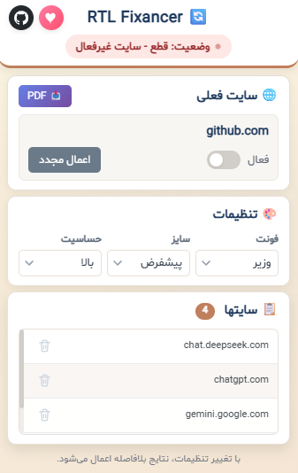

## RTL Fixancer

بهبود و راست‌چین کردن متن فارسی در سراسر وب. RTL Fixancer یک افزونه کروم است که زبان را برای هر عنصر تشخیص می‌دهد، جهت و تراز (RTL/LTR) را تغییر می‌دهد و فونت‌های تمیز فارسی را اعمال می‌کند. این افزونه روی **تمام وب‌سایت‌ها** کار می‌کند و برای رابط‌های کاربری چت هوش مصنوعی بهینه‌سازی شده است. می‌تواند چت‌ها/صفحات را با حفظ فونت‌ها و چیدمان به PDF صادر کند.



### ویژگی‌های برجسته
- **همه جا کار می‌کند**: با یک کلیک هر سایتی را فعال کنید. نیازی به پیکربندی خاص سایت نیست.
- **تشخیص هوشمند**: تشخیص زبان برای هر عنصر (فارسی در مقابل انگلیسی) با حساسیت قابل تنظیم.
- **جهت خودکار**: اعمال `direction` و تراز (RTL/LTR) با `unicode-bidi: isolate` برای متن‌های ترکیبی.
- **فونت‌های زیبای فارسی**: شامل نسخه‌های WOFF2 از Vazir/Shabnam برای بارگذاری سریع؛ فقط روی محتوای فارسی تشخیص داده شده اعمال می‌شود.
- **بهینه‌سازی شده برای چت هوش مصنوعی**: مدیریت پیشرفته برای Perplexity، Google AI Studio، ChatGPT و DeepSeek.
- **PDF با یک کلیک**: صادر کردن محتوای چت (یا کل صفحه) به نمای آماده چاپ که فونت‌ها، RTL/LTR و شکستن صفحه را حفظ می‌کند.
- **آگاه از SPA**: نظارت بر pushState/replaceState/popstate/hashchange و اعمال مجدد در تغییرات مسیر.
- **سریع و ایمن**: استفاده از MutationObserver + `requestIdleCallback` برای پردازش در زمان بیکاری؛ رد کردن بلوک‌های کد و کانتینرهای ساختاری.
- **جاوااسکریپت مدرن**: ساخته شده با الگوهای ۲۰۲۶ — `AbortController` برای پاکسازی خودکار رویدادها، `requestIdleCallback` برای پردازش در زمان بیکاری، عملگرهای `[...spread]` و `structuredClone()` برای مقایسه‌های عمیق.
- **فعال‌سازی برای هر سایت**: تغییر وضعیت سایت فعلی مستقیماً از پاپ‌آپ یا منوی راست کلیک؛ تغییرات فوراً اعمال می‌شود.

### روی تمام وب‌سایت‌ها کار می‌کند
RTL Fixancer روی **هر وب‌سایتی** که بازدید می‌کنید کار می‌کند. کافی است با کلید تغییر وضعیت پاپ‌آپ یا منوی راست کلیک، آن را برای سایت فعلی فعال کنید. در حالی که پشتیبانی پیشرفته‌ای برای پلتفرم‌های چت هوش مصنوعی دارد، تشخیص RTL و استایل فونت به طور جهانی کار می‌کند.

**پشتیبانی پیشرفته از:**
- `perplexity.ai`
- `aistudio.google.com` / `makersuite.google.com`
- `chat.openai.com` / `chatgpt.com`
- `deepseek.com`
- `gemini.google.com`
- و هر وب‌سایت دیگری با متن فارسی!

## نصب

### فروشگاه وب کروم
به زودی.

### نصب دستی (توسعه‌دهنده)
1) این مخزن را دانلود یا کلون کنید.
2) کروم را باز کنید و به `chrome://extensions` بروید.
3) "Developer mode" را فعال کنید.
4) روی "Load unpacked" کلیک کنید و پوشه افزونه را انتخاب کنید (ریپو اصلی که شامل `manifest.json` است).
5) افزونه را پین کنید و یک سایت پشتیبانی شده را باز کنید. از پاپ‌آپ برای فعال کردن سایت فعلی و تنظیم فونت‌ها/حساسیت استفاده کنید.

## استفاده
- از پاپ‌آپ برای تغییر وضعیت سایت فعلی، انتخاب فونت (Vazir/Shabnam/پیش‌فرض) و تنظیم حساسیت تشخیص استفاده کنید.
- روی "PDF" در پاپ‌آپ کلیک کنید تا محتوای چت یا صفحه را به یک پنجره چاپ صادر کنید. از دیالوگ چاپ مرورگر برای ذخیره به عنوان PDF استفاده کنید.
- منوی راست کلیک اقدامات سریع را فراهم می‌کند (تغییر وضعیت سایت، اعمال مجدد، صادر کردن PDF).

## مجوزها
- `storage` برای ذخیره تنظیمات (فونت، اندازه، حالت تشخیص، سایت‌های فعال).
- `activeTab`، `scripting`، `tabs`، `contextMenus` برای تزریق اسکریپت محتوا، ضبط تب قابل مشاهده در حین صادر کردن کل صفحه و اقدامات منوی راست کلیک.
- `host_permissions: <all_urls>` تا متن بتواند در سراسر سایت‌ها اصلاح شود (رفتار واقعی برای هر سایت توسط شما تغییر می‌کند).

## حریم خصوصی
- بدون تحلیل. بدون سرورهای خارجی. تمام پردازش محلی در مرورگر شما انجام می‌شود.
- فونت‌ها بسته‌بندی شده (WOFF2) و از بسته افزونه بارگذاری می‌شوند، نه از شبکه.
- صادر کردن PDF از دیالوگ چاپ سیستم استفاده می‌کند؛ در صورت نیاز، ضبط کل صفحه از `chrome.tabs.captureVisibleTab` محلی استفاده می‌کند.

## توسعه
- Manifest V3، اسکریپت محتوا در `document_start` تزریق می‌شود.
- MutationObserver + `requestIdleCallback` برای پردازش محتوای دیررس در زمان بیکاری.
- نظارت‌کننده مسیر SPA از طریق هوک‌های تاریخچه و رویدادها.
- انتخاب‌کننده‌های خاص سایت برای جلوگیری از تغییر هدرها/نوارهای کناری در رابط‌های کاربری پیچیده.
- `AbortController` برای پاکسازی خودکار شنونده‌های رویداد هنگام تخریب.
- جداسازی CSS بلوک و inline برای جلوگیری از مشکلات شکستن متن.

## معماری
- **اسکریپت محتوا** (`content.js`): موتور اصلی تشخیص RTL با کلاس `RTLAIStudioManager`.
- **سرویس‌ورکر پس‌زمینه** (`background.js`): منوهای راست کلیک، مدیریت آیکون، خروجی PDF.
- **پاپ‌آپ** (`popup.html` + `popup.js`): رابط کاربری تنظیمات با تغییر وضعیت سایت، کنترل‌های فونت/حساسیت.
- **کمک‌کننده چاپ** (`lib/print-helper.js`): پشتیبانی خروجی PDF.

## نقشه راه (ایده‌ها)
- پروفایل‌های بیشتر سایت (مثلاً سایر برنامه‌های چت/کار).
- میانبرهای صفحه کلید برای تغییر وضعیت/صادر کردن.
- برجسته‌سازی اختیاری عناصر پردازش شده در صفحه برای اشکال‌زدایی.

## مشارکت
مسائل و PR ها مورد استقبال قرار می‌گیرند. لطفاً سایت/URL را توصیف کنید و در صورت گزارش مشکلات چیدمان، اسکرین‌شات‌ها را شامل کنید.

## مجوز
CC BY-NC-ND 4.0 — `LICENSE` را ببینید.

## کمک مالی
اگر این پروژه به شما کمک می‌کند، یک کمک مالی کوچک در نظر بگیرید. متشکرم!

```
Wallet: 0x5ba08cc1429bead9c07dc2030b881c6ed33c3a00
```

## لینک‌ها
- GitHub: https://github.com/Nishef1/RTL-Fixancer
