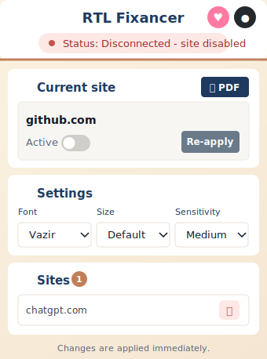

## RTL Fixancer

Smart RTL typography enhancement for Chrome. RTL Fixancer detects right-to-left text per element, fixes direction/alignment, applies readable fonts, and keeps mixed English + RTL content usable across modern web apps.



[فارسی / Persian README](README.fa.md)

### Highlights

- **Multilingual RTL support**: Persian/Farsi, Arabic, and Hebrew are registered through separate language modules.
- **Shared language engine**: `rtl-common.js` provides reusable detection and typography helpers so language configs stay small and duplicated logic is avoided.
- **English popup UI by default**: The extension popup now opens in English by default, with UI text centralized in `ui-i18n.js`.
- **Works everywhere**: Enable the current site from the popup or context menu. Core text enhancement works on any normal `http`/`https` page.
- **AI chat optimized**: Improved handling for ChatGPT, Perplexity, Google AI Studio, Gemini, DeepSeek, and similar chat interfaces.
- **Mixed text friendly**: Handles English + RTL paragraphs, lists, and dynamically generated content without forcing code blocks or protected structural UI.
- **Font-aware**: Uses bundled Vazir/Shabnam for Persian and system fallback stacks suitable for Arabic and Hebrew.
- **One-click PDF**: Use the popup or context menu to open a print-ready view and save content as PDF.
- **MV3 hardening**: Uses Manifest V3, avoids broad `host_permissions`, and guards scripting actions to supported tab URLs.

### Supported RTL languages

| Language | Module | Notes |
| --- | --- | --- |
| Persian / Farsi | `rtl-common.js` | Uses Vazir/Shabnam and Persian-specific detection helpers. |
| Arabic | `languages/arabic.js` | Uses Arabic-friendly system font fallbacks. |
| Hebrew | `languages/hebrew.js` | Uses Hebrew Unicode ranges and Hebrew-friendly font fallbacks. |

### Works on all websites

RTL Fixancer works on any normal website you visit. Enable it for the current site using the popup toggle or the right-click context menu. The extension is especially useful for AI chat UIs where Persian, Arabic, Hebrew, and English often appear in the same answer.

Enhanced support is targeted for:

- `chat.openai.com` / `chatgpt.com`
- `perplexity.ai`
- `aistudio.google.com` / `makersuite.google.com`
- `gemini.google.com`
- `deepseek.com`
- Any other website with RTL text

## Install

### Chrome Web Store

Coming soon.

### Manual developer install

1. Download or clone this repository.
2. Open Chrome and go to `chrome://extensions`.
3. Enable **Developer mode**.
4. Click **Load unpacked** and select the repository root folder that contains `manifest.json`.
5. Pin the extension, open a website, and enable that site from the popup.

## Usage

- Toggle the current site from the popup.
- Pick a font: `Vazir`, `Shabnam`, or browser default.
- Adjust detection sensitivity.
- Click **PDF** to use the browser print dialog and save the page/chat as a PDF.
- Use the right-click context menu for quick actions: toggle site, re-apply, export PDF.

## Permissions

- `storage`: saves settings such as font, size, detection mode, UI language, and enabled sites.
- `activeTab`, `scripting`: run the content script only for supported user-triggered actions.
- `tabs`, `contextMenus`: update extension icon state and provide right-click actions.

The manifest does **not** request broad `host_permissions`. The content script still runs on matched pages, but the extension behavior is controlled by the sites you enable.

## Privacy

- No analytics.
- No external servers.
- No user text is sent anywhere.
- Processing happens locally in your browser.
- Bundled fonts are loaded from the extension package, not from the network.
- PDF export uses the browser/system print dialog.

## Architecture

- **Shared RTL helpers**: `rtl-common.js`
- **Language modules**: `languages/arabic.js`, `languages/hebrew.js`
- **Core content engine**: `content.js`
- **Compatibility patches**: `content-patch.js`, `content-rtl-upgrade.js`
- **Background service worker**: `background.js`
- **Popup UI**: `popup.html`, `popup.js`, `popup-patch.js`
- **UI translations**: `ui-i18n.js`
- **PDF helper**: `lib/print-helper.js`

## Development notes

- Manifest V3 extension.
- Content scripts run at `document_start`.
- Uses `MutationObserver` and `requestIdleCallback` for late/dynamic content.
- Skips code/pre/input/textarea zones to avoid damaging code blocks and editable controls.
- Site activation is subdomain-aware.
- Popup UI language defaults to English via `ui-i18n.js`.

## Roadmap

- Optional UI language switcher inside the popup.
- More site-specific profiles for complex productivity apps.
- Debug overlay for processed RTL elements.
- Optional import/export for settings.

## Contributing

Issues and PRs are welcome. Please include the URL, browser version, screenshots, and a short before/after description when reporting layout or detection bugs.

## License

CC BY-NC-ND 4.0 — see `LICENSE`.

## Donate

If this project helps you, consider a small donation. Thank you!

```
Wallet: 0x5ba08cc1429bead9c07dc2030b881c6ed33c3a00
```

## Links

- GitHub: https://github.com/Nishef1/RTL-Fixancer
- فارسی / Persian: [README.fa.md](README.fa.md)
